##Tutorial 12: Refining and Visualizing Server Log Data

**This tutorial is from the [Hortonworks Sandbox 2.0](http://hortonworks.com/products/sandbox) - a single-node Hadoop cluster running in a virtual machine. [Download](http://hortonworks.com/products/sandbox) the Hortonworks Sandbox to run this and other tutorials in the series.**

### Summary

This tutorial describes how to refine raw server log data using the
Hortonworks Data Platform, and how to analyze and visualize this refined
log data using the Power View feature in Microsoft Excel 2013.

**Demo:** Here is the [Server Log
video](http://www.youtube.com/watch?v=BPC_mClNSXk) as a demo of what
you'll be doing in this tutorial.

### Server Log Data

Server logs are computer-generated log files that capture network and
server operations data. They are useful for managing network operations,
especially for security and regulatory compliance.

### Potential Uses of Server Log Data

IT organizations use server log analysis to answer questions about:

-   **Security** – For example, if we suspect a security breach, how can
    we use server log data to identify and repair the vulnerability?
-   **Compliance** – Large organizations are bound by regulations such
    as HIPAA and Sarbanes-Oxley. How can IT administrators prepare for
    system audits?

In this tutorial, we will focus on a network security use case.
Specifically, we will look at how Apache Hadoop can help the
administrator of a large enterprise network diagnose and respond to a
distributed denial-of-service attack.

### Prerequisites:

-   Hortonworks Sandbox (installed and running)
-   Hortonworks ODBC driver installed and configured – See Tutorials 7
    and 11 – Installing and Configuring the Hortonworks ODBC Driver
-   Microsoft Excel 2013 Professional Plus
-   Note, Excel 2013 is not available on a Mac. However, you can still
    connect the Sandbox to your version of Excel via the ODBC driver,
    and you can explore the data through the standard charting
    capabilities of Excel.
-   If you'd like to use Tableau to explore the data, please see this
    HOWTO on the Hortonworks website: [HOWTO: Connect Tableau to the
    Hortonworks
    Sandbox](http://hortonworks.com/kb/how-to-connect-tableau-to-hortonworks-sandbox/)
-   Server log tutorial files (included in this tutorial)

**Notes:**

-   In this tutorial, the Hortonworks Sandbox is installed on an Oracle
    VirtualBox virtual machine (VM).
-   Install the ODBC driver that matches the version of Excel you are
    using (32-bit or 64-bit).
-   In this tutorial, we will use the Power View feature in Excel 2013
    to visualize the server log data. Power View is currently only
    available in Microsoft Office Professional Plus and Microsoft Office
    365 Professional Plus.

### Overview

To refine and visualize server log data, we will:

-   Download and extract the server log tutorial files.
-   Install, configure, and start Flume.
-   Generate the server log data.
-   Import the server log data into Excel.
-   Visualize the server log data using Excel Power View.

* * * * *

Step 1: Download and Extract the Server Log Tutorial Files
----------------------------------------------------------

-   The files needed for this tutorial are contained in a compressed
    (.zip) folder that you can download here:

    [Download
    ServerLogFiles.zip](http://s3.amazonaws.com/hw-sandbox/tutorial12/serverfiles.zip)

-   Save the `ServerLogFiles.zip` file to your computer, then extract
    the files.

* * * * *

Step 2 – Install, Configure, and Start Apache Flume
---------------------------------------------------

### What Is Apache Flume?

**A service for streaming logs into Hadoop**. Apache Flume is a
distributed, reliable, and available service for efficiently collecting,
aggregating, and moving large amounts of streaming data into the Hadoop
Distributed File System (HDFS). It has a simple and flexible
architecture based on streaming data flows; and is robust and fault
tolerant with tunable reliability mechanisms for failover and recovery.

**What Flume Does**. Flume lets Hadoop users make the most of valuable
log data. Specifically, Flume allows users to:

-   **Stream data from multiple sources** into Hadoop for analysis
-   **Collect high-volume Web logs**in real time
-   **Insulate** themselves from transient spikes when the rate of
    incoming data exceeds the rate at which data can be written to the
    destination
-   **Guarantee data delivery**
-   **Scale horizontally** to handle additional data volume

**How Flume Works**. Flume's high-level architecture is focused on
delivering a streamlined codebase that is easy-to-use and
easy-to-extend. The project team has designed Flume with the following
components:

-   **Event** – a singular unit of data that is transported by Flume
    (typically a single log entry)
-   **Source** – the entity through which data enters into Flume.
    Sources either actively poll for data or passively wait for data to
    be delivered to them. A variety of sources allow data to be
    collected, such as log4j logs and syslogs.
-   **Sink** – the entity that delivers the data to the destination. A
    variety of sinks allow data to be streamed to a range of
    destinations. One example is the HDFS sink that writes events to
    HDFS.
-   **Channel** – the conduit between the Source and the Sink. Sources
    ingest events into the channel and the sinks drain the channel.
-   **Agent** – any physical Java virtual machine running Flume. It is a
    collection of sources, sinks and channels.
-   **Client** – produces and transmits the Event to the Source
    operating within the Agent

A flow in Flume starts from the Client. The Client transmits the event
to a Source operating within the Agent. The Source receiving this event
then delivers it to one or more Channels. These Channels are drained by
one or more Sinks operating within the same Agent. Channels allow
decoupling of ingestion rate from drain rate using the familiar
producer-consumer model of data exchange. When spikes in client side
activity cause data to be generated faster than what the provisioned
capacity on the destination can handle, the channel size increases. This
allows sources to continue normal operation for the duration of the
spike. Flume agents can be chained together by connecting the sink of
one agent to the source of another agent. This enables the creation of
complex dataflow topologies.

**Reliability & Scaling**. Flume is designed to be highly reliable,
thereby no data is lost during normal operation. Flume also supports
dynamic reconfiguration without the need for a restart, which allows for
reduction in the downtime for flume agents. Flume is architected to be
fully distributed with no central coordination point. Each agent runs
independent of others with no inherent single point of failure. Flume
also features built-in support for load balancing and failover. Flume's
fully decentralized architecture also plays a key role in its ability to
scale. Since each agent runs independently, Flume can be scaled
horizontally with ease.

**Note:** For more in-depth information about Flume, see **Appendix A:
Collecting Data in the Events Log.**

With the Hortonworks Sandbox virtual machine (VM) command prompt window
active, press the Alt and F5 keys, then log in to the Sandbox using the
following user name and password:

`login: root Password: hadoop`

After you log in, the command prompt will appear with the prefix
`[root@Sandbox \~]\#:`

At the command prompt, type in the following command, then press the
Enter key:

`yum install –y flume`

Lines of text appear as Flume installs. When the installation is
complete, "Complete!" is displayed, and the normal command prompt
appears.

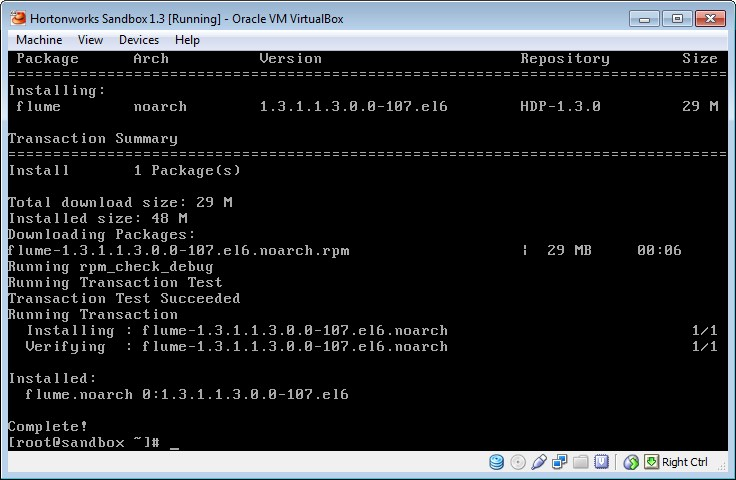

We will now use SCP to copy the flume.conf file to the Sandbox. The
procedure is slightly different for Windows and Mac, so both methods are
described here.

**Mac OS X: Copy the flume.conf File to the Sandbox**

Open a Terminal window and navigate to ServerLogFiles folder you
extracted previously. Type in the following command, then press the
Enter key:

`scp -P 2222 flume.conf root@127.0.0.1:/etc/flume/conf`

**Note:** You must use an uppercase "P" for the "-P" in this command.

You may be prompted to validate the authenticity of the host. Enter
"yes" when prompted.

When prompted, type in the Sandbox password ("hadoop"), then Press
Enter. This command will copy the flume.conf configuration file to the
`/etc/flume/conf` folder on the Sandbox.

Upon successful completion, you will receive a response back in your
terminal window that says:

`flume.conf          100% 1013   1.0KB/s   00:00`
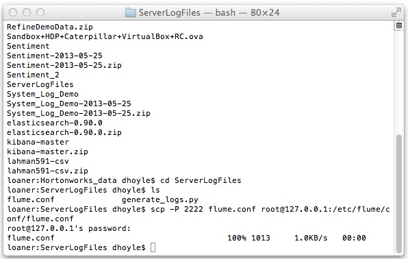

-   **Windows 7: Copy the flume.conf File to the Sandbox**

    On Windows you will need to download and install the free
    [WinSCP](http://winscp.net/eng/index.php) application.

    -   **a.** Open WinSCP and type in the following settings, then
        click **Login**.
    -   **Host name:** 127.0.0.1
    -   **Port:** 2222
    -   **User name:** root
    -   **b.**Type the Sandbox password ("hadoop") in the Password box,
        then click **OK**.
    -   **c.** Use the WinSCP file browser to navigate to the
        ServerLogFiles folder in the left-hand pane, and to the Sandbox
        etc/flume/conf folder in the right-hand pane.

        Drag-and-drop the flume.conf file from the ServerLogFiles folder
        to the `etc/flume/conf` folder on the Sandbox.

        Click **Copy** on the Copy pop-up to confirm the file transfer,
        then click **Yes** on the Confirm pop-up to confirm overwriting
        the existing flume.conf file.  

        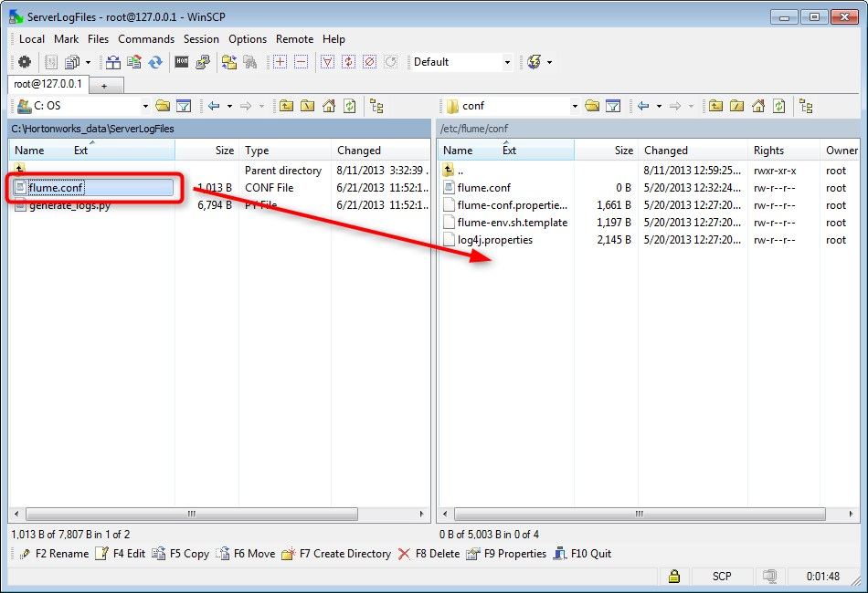

-   Next we will switch back to the Sandbox command prompt window and
    enable the Flume log by editing the
    `/etc/flume/conf/log4j`.properties file. At the Sandbox command
    prompt, type in the following command, then press the Enter key:

    `vi /etc/flume/conf/log4j.properties`

-   This command opens the log4j.properties file with the vi command
    line text editor.

    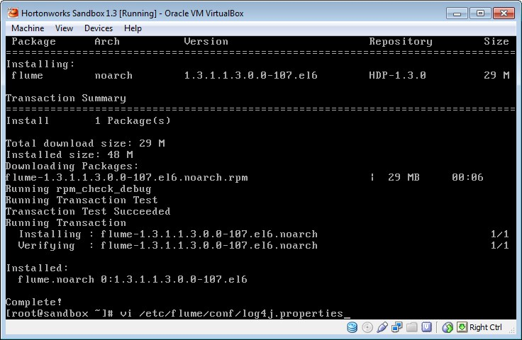

-   Press the "i" key to switch to Insert mode. "–INSERT–" will appear
    at the bottom of the command prompt window. Use the down-arrow key
    to scroll down until you find the following lines of text:

-   Use the arrow keys to position the cursor at the end of the second
    line. Use the Delete (Mac) or Backspace (Windows) key to delete
    "./logs", then type in "/var/log/flume". When you are finished, the
    text should be as follows:
-   Press the Escape key to exit Insert mode and return to Command mode.
    "–INSERT–" will no longer appear at the bottom of the command prompt
    window. Type in the following command, then press the Enter key:

    `:wq`

-   This command saves your changes and exits the vi text editor.

    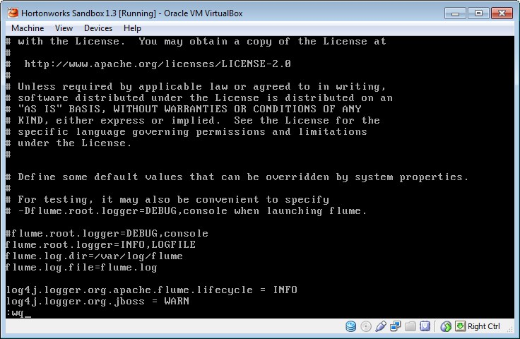

* * * * *

Step 3: Start Flume
-------------------

Next we will log into the Sandbox remotely using SSH. The procedure is
slightly different for Windows and Mac, so both methods are described
here.

**Mac OS X: Access the Sandbox Remotely Via SSH**

-   Type the following ssh command in the Terminal window, then press
    the Enter key. **Note:** You must use a lowercase "p" for the "-p"
    in this command.

    `ssh -p 2222 root@127.0.0.1`

-   When prompted, type in the Sandbox password (**"hadoop"**), then
    press Enter. The command prompt changes to `[root@Sandbox \~]\#` to
    indicate that you are now logged into the Sandbox. 

    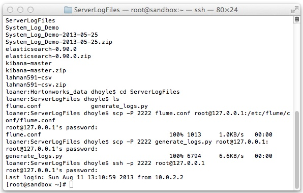

**Windows 7: Access the Sandbox Remotely Via SSH**

-   On Windows you will need to download and install the free
    [PuTTY](http://www.chiark.greenend.org.uk/%7Esgtatham/putty/download.html)
    application. Open PuTTY (putty.exe) and type in the following
    settings, then click **Open**.

    -   **Host Name (or IP address):** 127.0.0.1
    -   **Port:** 2222

        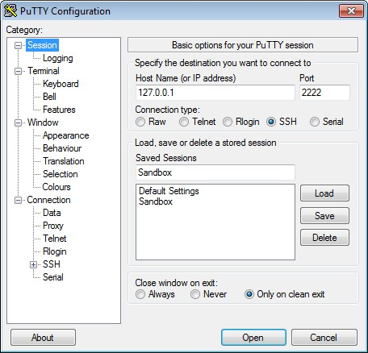

-   When prompted, type in the Sandbox user name (**"root"**) and
    password (**"hadoop"**), then press Enter. The command prompt
    changes to `[root@sandbox \~]\#` to indicate that you are now logged
    into the Sandbox.

    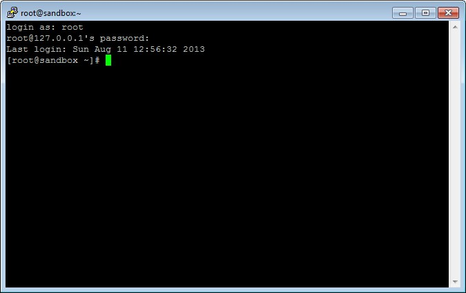

-   **Mac OS X or Windows 7:** To start Flume, type in the following
    command, then press the Enter key:

    `flume-ng agent -c /etc/flume/conf -f /etc/flume/conf/flume.conf -n sandbox`

    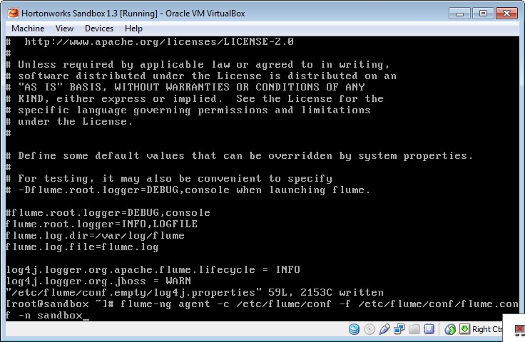

    Multiple lines of text will appear in the command prompt window as
    Flume starts. With Flume running, we will need to log in to the
    Sandbox remotely to generate the server log data.

    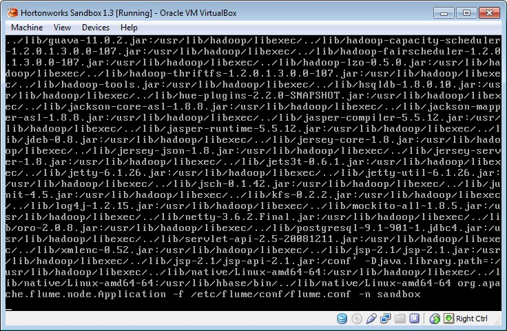

* * * * *

Step 4: Generate the Server Log Data
------------------------------------

Now that Flume is running, we will use a Python script to generate the
server log data, and then create an HCatalog table from the data.

-   We'll start by using SCP to copy the generate_logs.py file to the
    Sandbox. The procedure is slightly different for Windows and Mac, so
    both methods are described here.

    **Mac OS X: Copy the generate_logs.py File to the Sandbox**

    Open a Terminal window and navigate to ServerLogFiles folder. Type
    in the following command, then press the Enter key. **Note:** You
    must use an uppercase "P" for the "-P" in this command.

    `scp -P 2222 generate_logs.py root@127.0.0.1:`

    When prompted, type in the Sandbox password (**"hadoop"**), then
    Press Enter. This command will copy the `generate\_logs.py` file to
    the root folder on the Sandbox.

    Upon successful completion, you will receive a response back in your
    terminal window like the one below.

    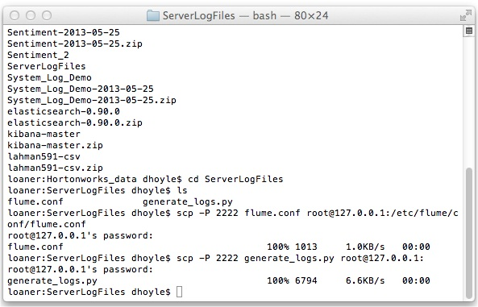

    **Windows 7: Copy the generate_logs.py File to the Sandbox**

    Log in to WinSCP as before. Use the WinSCP file browser to navigate
    to the ServerLogFiles folder in the left-hand pane, and to the
    sandbox `/root` folder in the right-hand pane.

    Drag-and-drop the `generate\_logs.py` file from the ServerLogFiles
    folder to the `/root` folder on the Sandbox.

    Click **Copy** on the Copy pop-up to confirm the file transfer.

    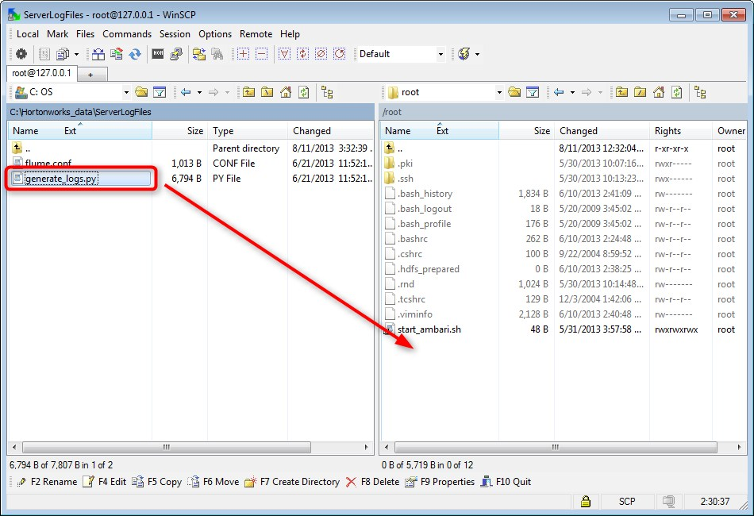

-   **Mac OS X or Windows 7:** In the active Sandbox SSH session in
    either the Mac Terminal or the PuTTY window, type in the following
    command to generate the log file, then press the Enter key:

    `python generate_logs.py`

    When the log file has been generated, a timestamp will appear, and
    the command prompt will return to normal (`[root@Sandbox \~]\#`). It
    may take several seconds to generate the log file.

-   Next we will create an HCatalog table from the log file. While still
    in the active Sandbox SSH session, type in the following command,
    then press the Enter key. **Note:** The command is shown here on
    multiple lines, but it should actually be entered in its entirety
    before pressing the Enter key. The text will wrap in the Terminal or
    PuTTY window as you type in the command. If cut and paste fails try
    typing it in by hand.

    `hcat -e "CREATE TABLE FIREWALL_LOGS(time STRING, ip STRING, country STRING, status STRING) ROW FORMAT DELIMITED FIELDS TERMINATED BY '|' LOCATION '/flume/events';"`

-   Open the Sandbox HUE user interface in a browser, then click
    **HCatalog** in the menu at the top of the page. The
    "firewall_logs" table will appear in the HCatalog table list.
    Select the check box next to the "firewall_logs" table, then click
    **Browse Data**. You should see columns with data for time, ip,
    country, and status. If you do not see data take a look at the
    [Troubleshooting](#troubleshooting) section.

* * * * *

Step 5: Import the Server Log Data into Excel
---------------------------------------------

In this section, we will use Excel Professional Plus 2013 to access the
generated server log data. Note: if you do not have Excel 2013, you can
still bring the data into other versions of Excel and explore the data
through other charts. The screens may be slightly different in your
version, but the actions are the same. You can complete Step 5 and then
explore the data on your own.

-   In Windows, open a new Excel workbook, then select **Data > From
    Other Sources > From Microsoft Query**.

    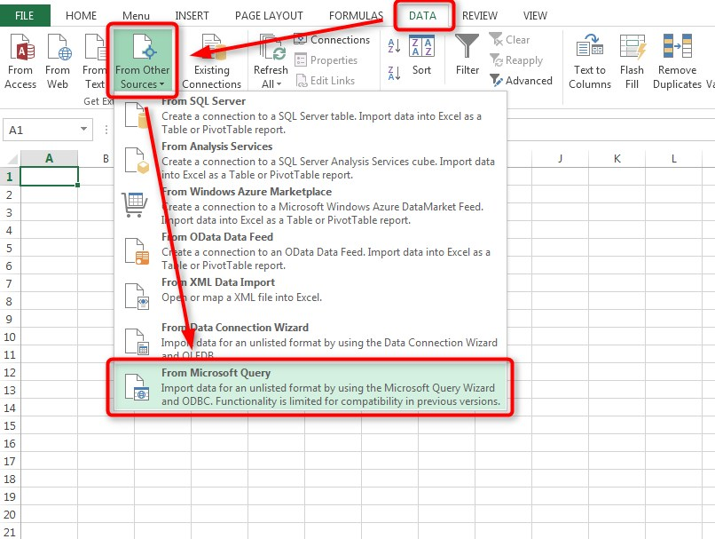

-   On the Choose Data Source pop-up, select the Hortonworks ODBC data
    source you installed previously, then click **OK**.

    The Hortonworks ODBC driver enables you to access Hortonworks data
    with Excel and other Business Intelligence (BI) applications that
    support ODBC.

    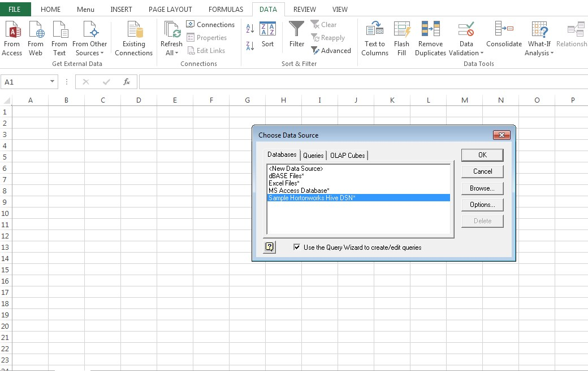

-   After the connection to the Sandbox is established, the Query Wizard
    appears. Select the "firewall_logs" table in the Available tables
    and columns box, then click the right arrow button to add the entire
    "firewall_logs" table to the query. Click **Next** to continue.

    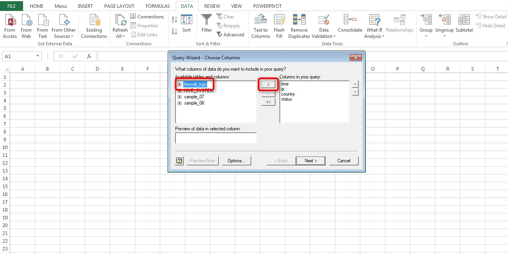

-   On the Filter Data screen, click **Next** to continue without
    filtering the data.

    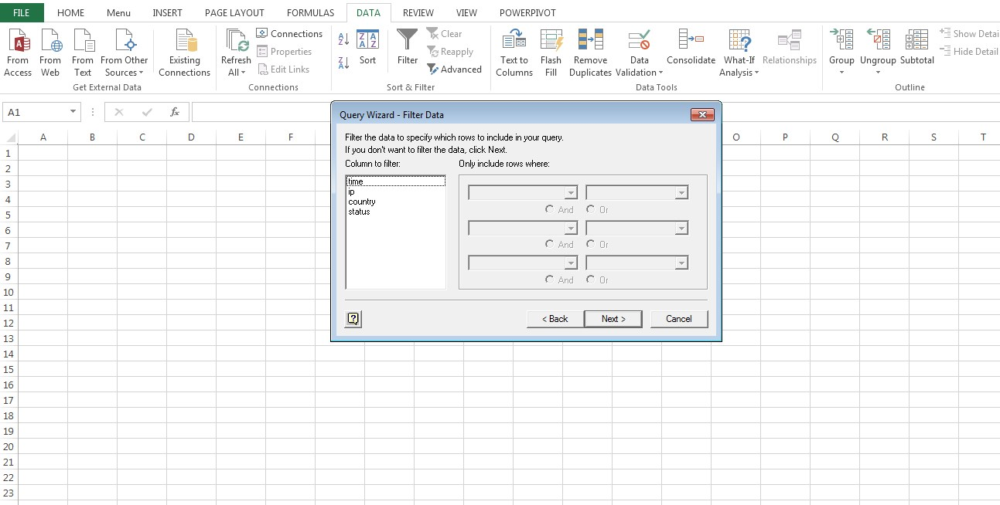

-   On the Sort Order screen, click **Next** to continue without setting
    a sort order.

    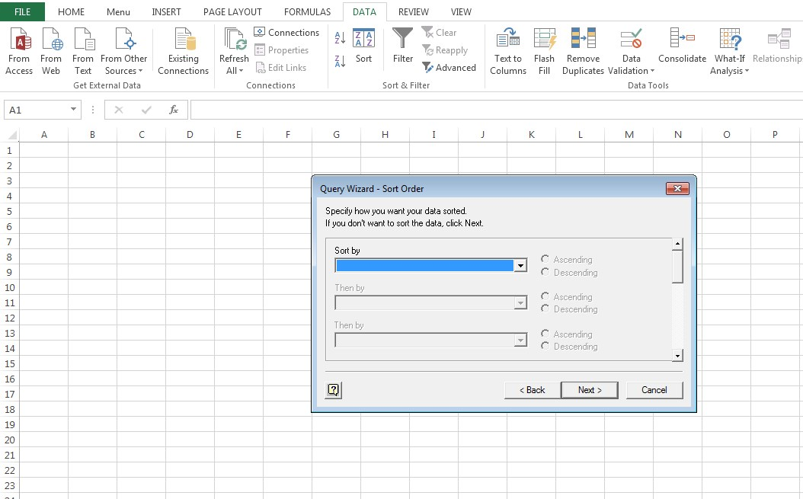

-   Click **Finish** on the Query Wizard Finish screen to retrieve the
    query data from the Sandbox and import it into Excel.

    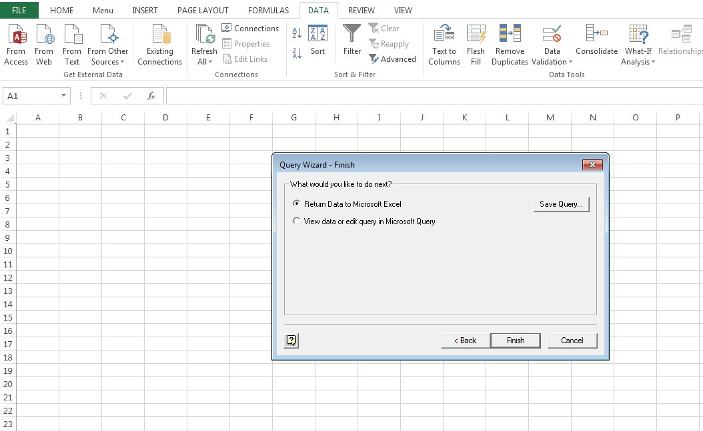

-   On the Import Data dialog box, click **OK** to accept the default
    settings and import the data as a table.

    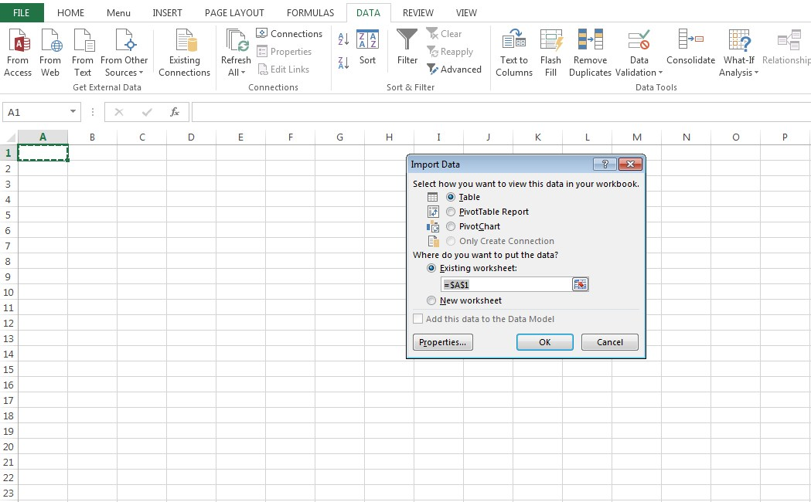

-   The imported query data appears in the Excel workbook.

    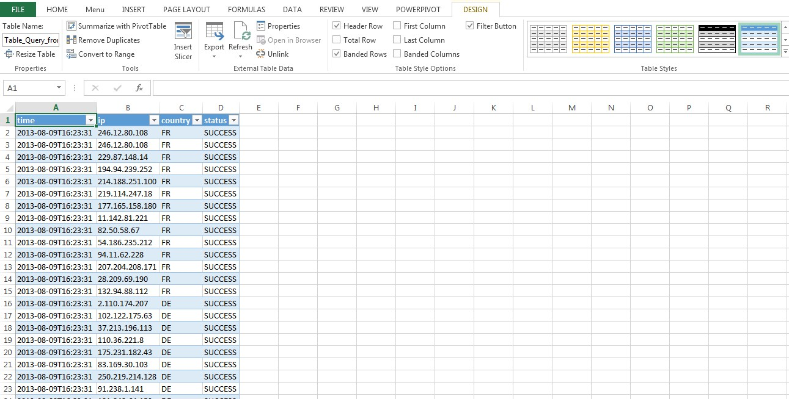

Now that we have successfully imported Hortonworks Sandbox data into
Microsoft Excel, we can use the Excel Power View feature to analyze and
visualize the data.

* * * * *

Step 6: Visualize the Sentiment Data Using Excel Power View
-----------------------------------------------------------

Data visualization can help you analyze network data and determine
effective responses to network issues. In this section, we will analyze
data for a denial-of-service attack:

-   Review the network traffic by country
-   Zoom in on one particular country
-   Generate a list of attacking IP addresses

We'll start by reviewing the network traffic by country.

-   In the Excel worksheet with the imported "\<firewall_logs>" table,
    select **Insert > Power View** to open a new Power View report.
    (note: if this is your first time running PowerView it will prompt
    you to [install
    Silverlight](#Excel%20configuration%20for%20PowerView).

    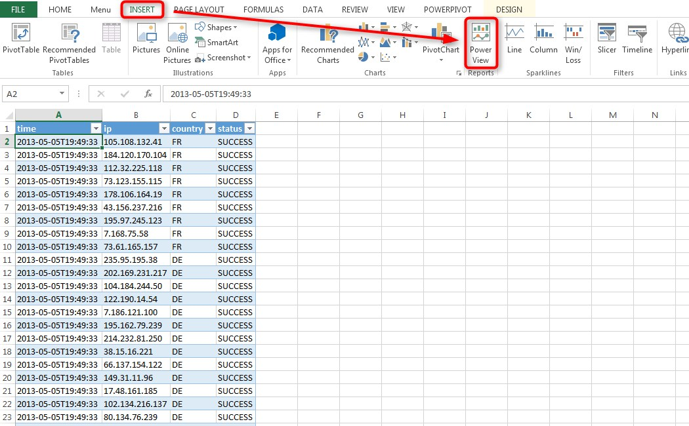

-   The Power View Fields area appears on the right side of the window,
    with the data table displayed on the left.

    Drag the handles or click the Pop Out icon to maximize the size of
    the data table, and close the Filters area.

    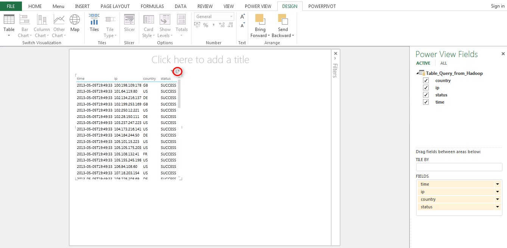

-   In the Power View Fields area, clear checkboxes next to the **ip**
    and **time** fields, then click **Map** on the Design tab in the top
    menu. (**Note:** If you do not get data plotted on your map look at
    [Geolocation of data using
    Bing](#Geolocation%20of%20data%20using%20Bing))

    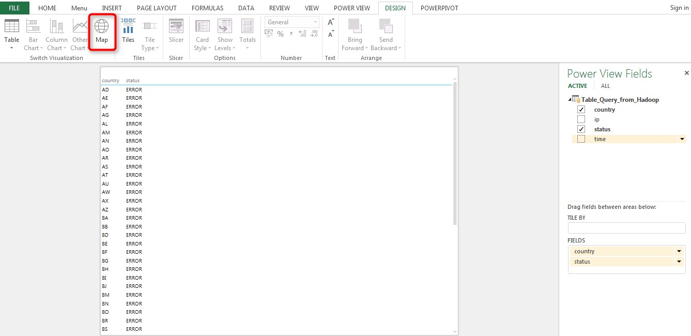

-   Drag the **status** field into the **SIZE** box.

    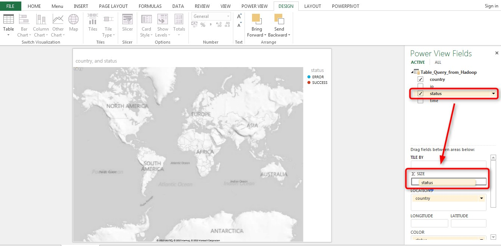

-   The map view displays a global view of the network traffic by
    country. The color orange represents successful, authorized network
    connections. Blue represents connections from unauthorized sources.

    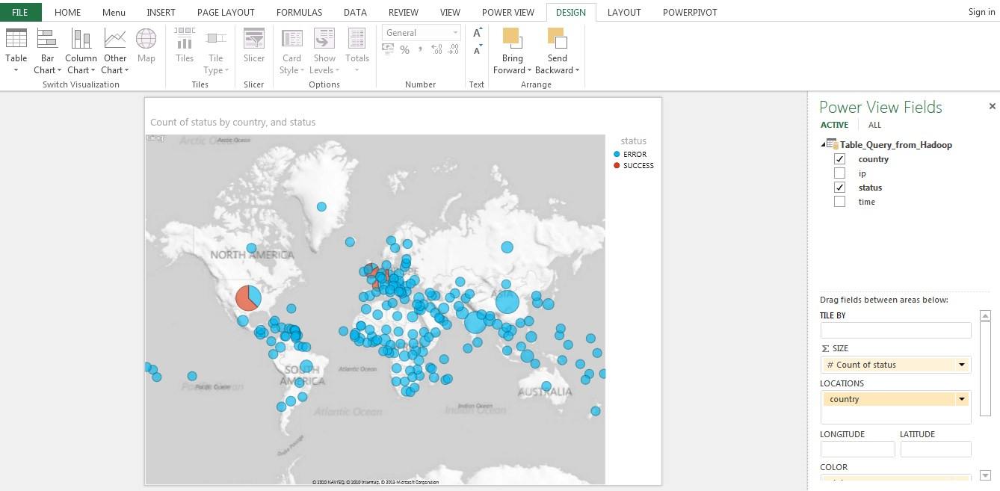

-   Let's assume that recent denial-of-service attacks have originated
    in Pakistan. We can use the map controls to zoom in and take a
    closer look at traffic from that country.

    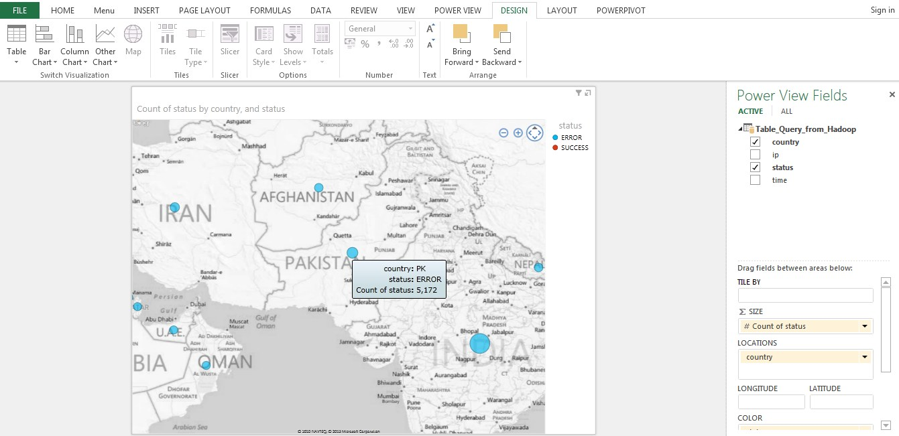

    It's obvious that this is a coordinated attack, originating from
    many countries. Now we can use Excel to generate a list of the
    unauthorized IP addresses.

-   Use the tabs at the bottom of the Excel window to navigate back to
    the Excel worksheet with the imported "\<firewall_logs>" table.

    Click the arrow next to the **status** column header. Clear the
    **Select all** check box, select the **ERROR** check box, then click
    **OK**.

    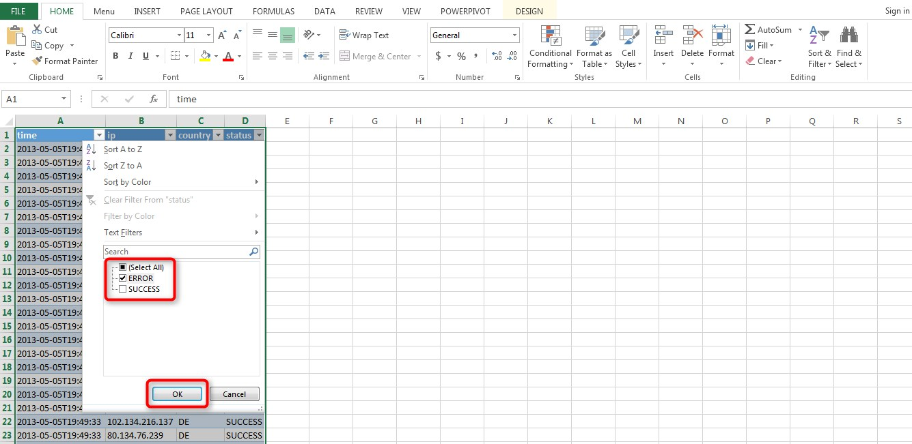

-   Now that we have a list of the unauthorized IP addresses, we can
    update the network firewall to deny requests from those attacking IP
    addresses.

We've shown how the Hortonworks Data Platform can help system
administrators capture, store, and analyze server log data. With
real-time access to massive amounts of data on the Hortonworks Data
Platform, we were able to block unauthorized access, restore VPN access
to authorized users.

With log data flowing continuously into the Hortonworks Data Platform
"data lake," we can protect the company network from similar attacks in
the future. The data can be refreshed frequently and accessed to respond
to security threats, or to prepare for compliance audits.

* * * * *

Appendix A: Collecting Data in the Events Log
---------------------------------------------

This appendix contains further discussion regarding how the server log
data was generated and transferred into HDFS in this tutorial. This
information is of interest when you set up your own Flume source.

### Basic Flume architecture:

The Apache Flume project is a robust and reliable set of code that
captures, aggregates and transfers high volumes of log data into Apache
Hadoop. The major components of Flume are:

-   Sources – event input
-   Sinks – event output
-   Channels – connections between the sources and sinks.

More details about these Flume components can be found at:

[http://www.drdobbs.com/database/acquiring-big-data-using-apache-flume/240155029](http://www.drdobbs.com/database/acquiring-big-data-using-apache-flume/240155029)

### Collecting data in the Events Log

The  event log uses a very simple model consisting of one source, one
sink and a channel to interconnect the two.

Our source is a file that Flume will watch using a tail command to
collect the deltas. If you look at the flume.conf file you will see:

`# Define/Configure sourcesandbox Sandbox.sources.eventlog.type = execsandbox Sandbox.sources.eventlog.command = tail -F /var/log/eventlog-demo.logsandboxSandbox.sources.eventlog.restart = true sandboxSandbox.sources.eventlog.batchSize = 1000 sandboxSandbox.sources.eventlog.type = seq`
`` `Define / Configure      sourcesandboxSandbox.sources.eventlog.type = execsandboxSandbox.sources.eventlog.command = tail -F /var/log/eventlog-demo.logsandboxSandbox.sources.eventlog.restart = truesandboxSandbox.sources.eventlog.batchSize = 1000     #sandboxSandbox.sources.eventlog.type = seq ~~~~ ``

So for each collection cycle Flume will run the tail command on the
eventlog-demo.log file. It will collect the deltas and pass them to the
channel as defined by this section of the flume.conf file:

`~~~~ Use a channel which buffers events in memorysandbox.channels.filechannel.type = filesandbox.channels.filechannel.checkpointDir = /var/flume/checkpointsandbox.channels.file_channel.dataDirs = /var/flume/data`
`# Bind the source and sink to the channelsandbox.sources.eventlog.channels = file_channelsandbox.sinks.sink_to_hdfs.channel = file_channel`

On the other end of the channel is a sink that writes into HDFS, as
defined here:

`# HDFS sinkssandbox.sinks.sink_to_hdfs.type = hdfssandbox.sinks.sink_to_hdfs.hdfs.fileType = DataStreamsandbox.sinks.sink_to_hdfs.hdfs.path = /flume/eventssandbox.sinks.sink_to_hdfs.hdfs.filePrefix = eventlogsandbox.sinks.sink_to_hdfs.hdfs.fileSuffix = .logsandbox.sinks.sink_to_hdfs.hdfs.batchSize = 1000`

The thing to note here is that the path in Sandbox.
sinks_to_hdfs.hdfs.path is in the HDFS file system, not the Linux file
system. So you can use the file browser in the Sandbox to look at the
/flume/events directory to see the data collected.

Once we have the data in /flume/events, we can define a table using hcat
using this command:

`CREATE TABLE FIREWALL_LOGS(time STRING, ip STRING, country STRING, status STRING) ROW FORMAT DELIMITED FIELDS TERMINATED BY '|' LOCATION '/flume/events';`

We end up with a table named FIREWALL_LOGS and we project a structure
that has the fields time, ip, country, and status. If you browse
FIREWALL_LOGS in the HCat tab in the Sandbox, you will see the table.

Once we have the FIREWALL_LOGS table, we can treat it like any other
table and run Hive queries or PIG scripts on it. It looks like any other
data in HDFS.

Now that we have set up the flow to capture the data, we need to produce
some data to feed in the pipe. For the purposes of the tutorial, we just
use a data generation Python script (generate_logs.py).

If we look at the Python code there are a few key lines. The first is
where the eventlog-demo.log file is defined:

`parser.add_option("-f", "--logfile", dest="logfile", help="Specify a log file. Default=/var/log/eventlog-demo.log", default="/var/log/eventlog-demo.log", type="string")`

If you recall, this is the file that Flume is watching to collect data
from the source.

The routing generate_log is called from the main() routine to write out
the log file entries.

`def generate_log(timestamp,users,status,logfile):  logging.basicConfig(filename=logfile,         format='%(message)s',         level=logging.DEBUG)if status == 'SUCCESS': countries = weight\_good\_country(users)else :    countries = weight\_bad\_country(users)for country, concurrent_user in countries.iteritems(): i = 0 while i < concurrent_user :        logging.info('%s|%s|%s|%s'%(timestamp, random_ip(), country, status))     i += 1`

So we have our full pipeline:

-   Flume watches eventlog-demo.log for data.
-   Data is captured and written to /flume/event in HDFS.
-   Running generate_logs.py creates the data and writes it to
    eventlog-demo.log for capture.

If you would like to customize the tutorial for your own data, you can
start off with this very simple example. Just collect your data into a
rotating log file. Have Flume watch the primary file and collect data
using the same tail command we use here. The data should be accumulated
into HDFS where you can process it.

**Feedback**

We are eager to hear your feedback on this tutorial. Please let us know
what you think. [Click here to take
survey](https://www.surveymonkey.com/s/SandboxT12ServerLog)
